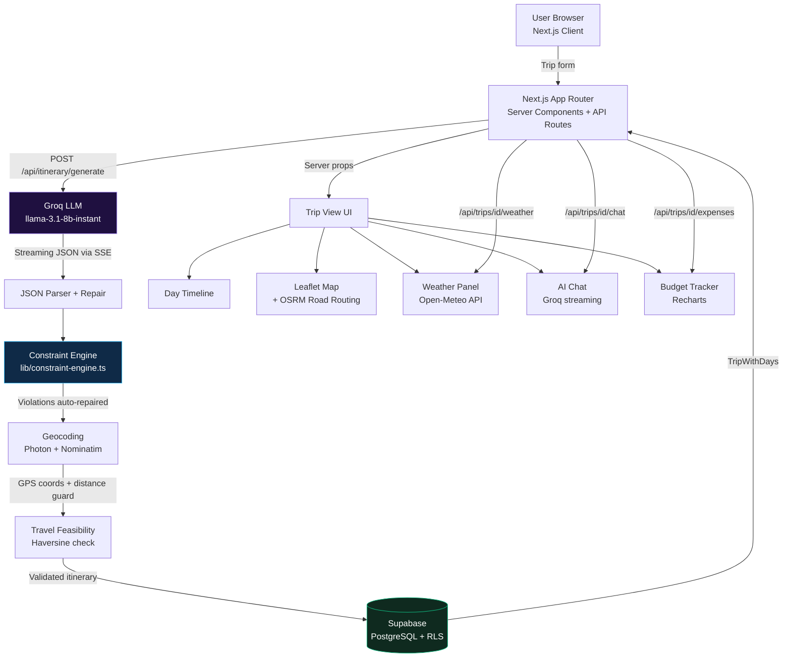

# Roamly

A full-stack AI travel planning application that converts user trip preferences into structured, time-aware itineraries using a Groq LLM, then validates and repairs that output through a deterministic constraint engine before persisting it to a Supabase PostgreSQL backend.

The core engineering problem is making LLM output production-safe: parsing and repairing streaming JSON, enforcing real-world scheduling constraints (arrival windows, meal slots, place-type rules), geocoding every stop with spatial accuracy guards, and routing between them via OSRM — all before any data reaches the database.

**[Live Demo →](https://roamly-ten.vercel.app)**

---

## Features

- **AI itinerary generation** — Groq-powered (`llama-3.1-8b-instant`), streams progress via SSE; respects arrival/departure times, hotel check-in/out, pace, budget, interests, dietary needs, and must-visit places
- **Constraint engine** — deterministic post-AI validation layer: deduplicates places, enforces meal window completeness, repairs time window violations, flags structurally broken days for regeneration
- **Day-by-day view** — per-day weather forecast, sightseeing places with GPS coordinates and timing rationale, restaurant picks, and quick tips
- **Interactive map** — Leaflet map with numbered pins per place; real-road routing between stops via OSRM
- **Budget tracker** — log expenses by category, visualise spending with Recharts
- **Trip sharing** — public share link or email-invite collaborators (Gmail SMTP + Resend fallback)
- **AI chat assistant** — trip-scoped Groq chat with full itinerary context injected as system prompt
- **PDF export** — server-side PDF generation via `@react-pdf/renderer`
- **Offline access** — PWA with localStorage (15-trip LRU) + IndexedDB cache; saved itineraries readable without internet

---

## Key Engineering Highlights

**Constraint Engine** (`src/lib/constraint-engine.ts`)
A rule-based validation layer that runs between LLM output and the database write. It applies four deterministic rules in sequence: deduplicate places within the same day, repair time window violations per place type (delegating to `itinerary-validator.ts`), inject missing meal types (breakfast/lunch/dinner) with fallback entries, and flag any day with zero remaining places as `needsReview`. When `needsReview` is true, the generation route triggers one automatic regeneration attempt before surfacing an error to the client. A fifth rule runs after geocoding: consecutive places are checked against a 40 km/h city travel speed to detect physically infeasible transitions and log them as structured warnings.

**SSE Streaming Pipeline** (`src/app/api/itinerary/generate/route.ts`)
Itinerary generation uses a `ReadableStream` to push Server-Sent Events to the client throughout the 15–30 second Groq LLM call. The pipeline stages — token streaming, JSON extraction, constraint validation, geocoding, DB write — emit distinct progress events so the UI reflects actual server state rather than a fake timer. Retry logic handles JSON parse failures (up to 2 attempts) and a pre-flight token guard prevents 413 errors before the Groq call is even made.

**Geospatial Pipeline** (`src/app/api/itinerary/generate/route.ts`)
After generation, every place is geocoded via Photon (Komoot) with a Nominatim city-center fallback. A Haversine distance guard rejects any coordinate more than 150 km from the destination city center, preventing the model from hallucinating places in another country. The geocoding step runs concurrently across all places using `Promise.allSettled`.

**Hybrid Offline Cache** (`src/lib/offline-cache.ts`, `src/hooks/useOfflineTrips.ts`)
Trips are stored in both localStorage (15-trip LRU eviction, fast synchronous access) and IndexedDB (via `idb`, larger quota, structured storage) every time a trip view loads. The PWA service worker (`@ducanh2912/next-pwa`) intercepts navigation requests and serves the `/offline` fallback page when the network is unreachable.

**RLS-Secured Collaboration** (`supabase/schema.sql`)
Multi-user access is implemented with Supabase Row Level Security. Two `SECURITY DEFINER` helper functions (`rls_is_trip_owner`, `rls_is_trip_collaborator`) break the circular evaluation that would otherwise occur when policies on `trips` query `trip_collaborators` and vice versa. Invitation tokens are used as the sole secret for invite acceptance — a `SECURITY DEFINER` RPC bypasses RLS to look up the token before the invitee is authenticated.

**Structured Logging** (`src/lib/with-logger.ts`, `src/lib/logger.ts`)
Every API route is wrapped in a `withLogger` higher-order function that creates a pino child logger per request and stores it in `AsyncLocalStorage`. Any function in the call stack can call `getLog()` to retrieve the logger with the request ID already attached — without passing it as a parameter. Edge middleware uses a manually structured JSON schema that matches pino's output format.

---

## How It Works

```
1. User fills a 3-step form: destination + dates, hotel, preferences (pace, budget, interests, dietary)

2. POST /api/itinerary/generate
   → Pre-flight token guard (abort if prompt would exceed 6,000 TPM free tier limit)
   → Groq LLM (llama-3.1-8b-instant) streams a structured JSON itinerary
   → SSE progress events pushed to client throughout

3. JSON extraction + repair
   → stripGroqJson() removes markdown fences and prose preamble
   → robustRepairJson() closes truncated brackets (handles max_tokens cut-off)
   → Retry once on parse failure

4. Constraint Engine (lib/constraint-engine.ts)
   → Rule 1: Remove duplicate place names within each day
   → Rule 2: Repair time window violations per place type (landmark, beach, museum, etc.)
   → Rule 3: Inject missing breakfast / lunch / dinner with fallback entries
   → Rule 4: Flag days with 0 places → trigger one regeneration attempt

5. Geocoding (Photon / Nominatim)
   → City center geocoded via Nominatim (once, for bounding box)
   → Each place geocoded via Photon with Haversine guard (reject if > 150 km from city)
   → Runs concurrently via Promise.allSettled

6. Post-geocoding travel feasibility check
   → Consecutive places with GPS coords checked against 40 km/h city travel speed
   → Infeasible transitions logged as structured warnings (non-blocking)

7. Save to Supabase (trips + itinerary_days tables)

8. SSE { type: "complete", tripId } → client redirects to /trips/[id]

9. Trip view renders:
   → Day timeline with places, timing, tips
   → Leaflet map with OSRM road routing between stops
   → Open-Meteo weather overlay (1-hour Supabase cache)
   → AI chat panel (trip context injected as system prompt)
   → Budget tracker (expenses per category, Recharts visualisation)
```

---

## System Architecture



---

## Tech Stack

| Layer | Technology |
|---|---|
| Framework | Next.js 14 (App Router, Server + Client Components) |
| Language | TypeScript |
| Styling | Tailwind CSS + inline style objects |
| Auth & Database | Supabase (PostgreSQL + Row Level Security) |
| AI | Groq API (`llama-3.1-8b-instant`) |
| Maps | Leaflet + react-leaflet + OSRM road routing |
| Geocoding | Photon (Komoot) + Nominatim (OpenStreetMap) |
| Weather | Open-Meteo (no API key, 1-hour Supabase cache) |
| Charts | Recharts |
| PDF | @react-pdf/renderer (server-side) |
| Email | Nodemailer (Gmail SMTP) + Resend (fallback) |
| Logging | pino + AsyncLocalStorage per-request context |
| Offline | @ducanh2912/next-pwa + localStorage + IndexedDB (idb) |
| Testing | Vitest + Testing Library |
| Deployment | Vercel |

---

## Getting Started

### Prerequisites

- Node.js 18+
- A [Supabase](https://supabase.com) project
- A [Groq](https://console.groq.com) API key (free tier works)

### Install

```bash
git clone https://github.com/mrinali123/Roamly.git
cd Roamly
npm install
```

### Environment variables

```bash
cp .env.local.example .env.local
```

| Variable | Where to get it |
|---|---|
| `NEXT_PUBLIC_SUPABASE_URL` | Supabase → Project Settings → API |
| `NEXT_PUBLIC_SUPABASE_ANON_KEY` | Supabase → Project Settings → API |
| `NEXT_PUBLIC_APP_URL` | `http://localhost:3000` for local dev |
| `GROQ_API_KEY` | [console.groq.com](https://console.groq.com) |
| `RESEND_API_KEY` | [resend.com](https://resend.com) — optional, for invite emails |
| `GMAIL_USER` | Your Gmail address — for invite emails via SMTP |
| `GMAIL_APP_PASSWORD` | Google Account → Security → App Passwords |

### Database

In your Supabase project, open **SQL Editor → New query**, paste the contents of `supabase/schema.sql`, and run it. That single file creates all tables, indexes, RLS policies, and functions.

Then add your app URLs to **Supabase → Authentication → URL Configuration → Redirect URLs**:

```
http://localhost:3000/auth/callback
https://your-production-domain.com/auth/callback
```

### Run locally

```bash
npm run dev
```

### Tests

```bash
npm test
```

---

## Project Structure

```
src/
├── app/
│   ├── api/
│   │   ├── itinerary/generate/   # Core SSE generation pipeline
│   │   ├── trips/[id]/           # chat, collaborators, expenses, export-pdf, share, weather
│   │   ├── chat/                 # General dashboard AI chat
│   │   └── invite/[token]/       # Accept collaboration invite
│   ├── auth/                     # Sign in, sign up, reset password
│   ├── dashboard/                # Trip list with stats
│   ├── trips/
│   │   ├── new/                  # 3-step trip creation form + SSE generation screen
│   │   └── [id]/                 # Trip detail view + edit
│   └── share/[token]/            # Public read-only trip view
├── components/
│   ├── itinerary/                # DayTimeline, PlaceCard, WeatherCard, MealsCard
│   ├── map/                      # TripMap (Leaflet + OSRM)
│   ├── chat/                     # ChatPanel (streaming), GeneralChatPanel
│   ├── budget/                   # BudgetTracker, ExpenseForm, SpendingChart
│   └── dashboard/                # HeroCarousel, TripCard, StatCard
├── lib/
│   ├── constraint-engine.ts      # Post-AI validation + repair (Rules 1–5)
│   ├── itinerary-validator.ts    # Time window scheduling repair
│   ├── itinerary-scheduler.ts    # Per-place-type schedule rules
│   ├── db/trips.ts               # All Supabase queries
│   ├── prompts/                  # System prompt + user prompt builders
│   ├── with-logger.ts            # withLogger HOF + AsyncLocalStorage getLog()
│   └── supabase/                 # Client, server, and Edge middleware helpers
└── types/                        # TypeScript interfaces (trip, budget, weather)
```

---

## Deployment

Push to GitHub and import into [Vercel](https://vercel.com). Add all environment variables in Vercel → Project Settings → Environment Variables. Vercel auto-deploys on every push to `main`.

## License

MIT
