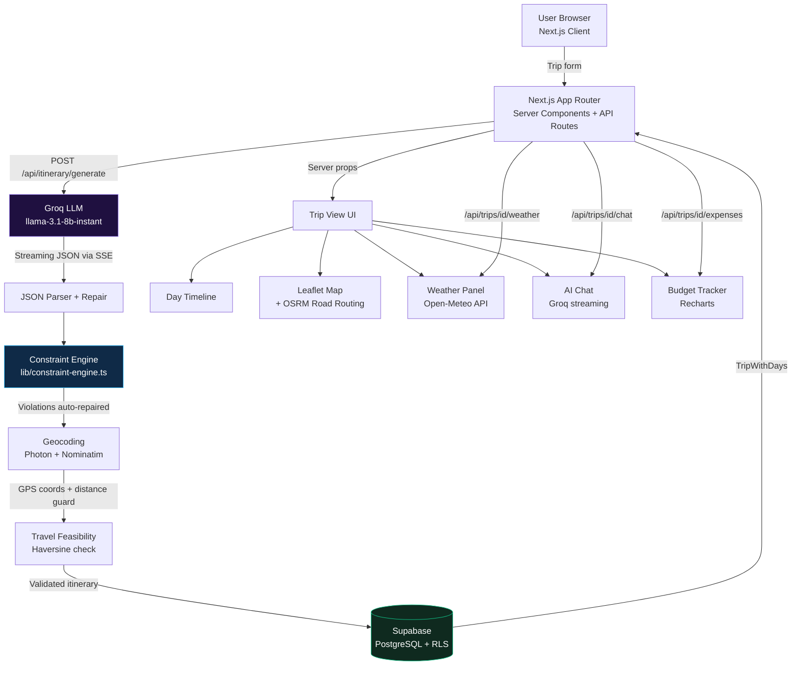

# Navoryn

> AI travel planner with a deterministic validation layer that converts probabilistic LLM output into structured, physically feasible itineraries before database storage.

**Most AI travel tools generate an itinerary and call it done.**  
**Navoryn generates one, then runs it through a deterministic constraint engine that checks scheduling conflicts, missing meals, and physical feasibility before anything reaches the database.**

Built with Next.js 14, Groq, Supabase, and a custom post-AI validation layer — this is a full-stack engineering project, not a GPT wrapper.

Transforms LLM-generated travel plans into production-safe, constraint-validated itineraries with real-world feasibility guarantees.

**[Live Demo →](https://navoryn.vercel.app)** · 🎥 **[Watch Demo Video](#)** ← _replace `#` with Loom / YouTube link_

---

## Screenshots

| Dashboard | Trip View — Day Timeline |
|---|---|
|  |  |

| Interactive Map (OSRM routing) | Budget Tracker |
|---|---|
|  |  |

> _Add real captures to `docs/screenshots/` before publishing._

---

## What Navoryn Does

You fill out a 3-step form — destination, hotel, dates, pace, and interests. Navoryn calls a Groq LLM and streams the generation live via Server-Sent Events, so you see real progress instead of a spinner. Once generated, the itinerary passes through a deterministic validation pipeline before it's saved — then you're dropped into a day-by-day trip view with an interactive road-routing map, AI chat assistant, weather overlay, budget tracker, PDF export, and a shareable public link.

---

## Why It's Different

LLM outputs are probabilistic. A language model generating a travel itinerary might schedule a restaurant at 9 AM, place the same museum twice on the same day, or suggest a location 300 km outside the destination.

Navoryn treats LLM output as untrusted input. After generation, a five-rule deterministic constraint engine intercepts every response before the database sees it:

| Rule | What it fixes |
|---|---|
| Deduplication | Removes repeated place names within the same day |
| Time window repair | Repositions activities that fall outside valid hours per place type (landmarks at golden hours, restaurants at meal windows, etc.) |
| Meal completeness | Injects missing breakfast / lunch / dinner entries with fallback data when the model omits them |
| Structural integrity | Flags any day with zero remaining places and triggers automatic regeneration |
| Travel feasibility | Checks that consecutive geocoded places are physically reachable within the scheduled time gap, at a conservative 40 km/h city speed |
| End result | Fully structured, time-consistent, geographically valid itineraries stored safely in DB |

This is the project's core engineering contribution. The constraint engine is what separates it from "AI generates text, display text" — every saved itinerary is structurally valid, geographically grounded, and time-consistent.

---

## Features

### AI System
- **AI itinerary generation** — Groq-powered (`llama-3.1-8b-instant`), streams progress via SSE; respects arrival/departure times, hotel check-in/out, pace, budget, interests, dietary needs, and must-visit places
- **AI chat assistant** — trip-scoped Groq chat with the full itinerary injected as system prompt; understands context like "what if it rains on Day 2?"

### Constraint Engine
- **Post-AI validation layer** — five deterministic rules run between LLM output and DB write: deduplication, time window repair, meal injection, structural integrity check, and travel feasibility guard
- **Auto-repair + retry** — violations are fixed automatically where possible; structurally broken days trigger one automatic regeneration attempt before surfacing an error

This layer ensures AI output is never directly trusted or persisted.

### Geospatial Layer
- **Interactive map** — Leaflet map with numbered pins per place; real-road routing between stops via OSRM (not straight lines)
- **Geocoding** — Photon (Komoot) primary with Nominatim fallback; Haversine guard rejects coordinates more than 150 km from the city center
- **Weather overlay** — per-day forecast from Open-Meteo with 1-hour Supabase cache

### Data & Infrastructure
- **Budget tracker** — log expenses by category, visualise spending with Recharts
- **Trip sharing** — public share link or email-invite collaborators (Gmail SMTP + Resend fallback)
- **PDF export** — server-side generation via `@react-pdf/renderer`; branded cover page, per-day sections, and tips page
- **Offline access** — PWA with localStorage (15-trip LRU) + IndexedDB cache; saved itineraries readable without internet
- **Collaboration** — RLS-secured multi-user access with role-based permissions (viewer / editor); invite tokens as the sole auth secret

---

## Demo Flow

> Recommended: watch the demo video first before reading steps.

The live demo is open — sign up free to generate itineraries (uses Groq's free tier).

1. **Create a trip** — pick any destination (e.g., Paris, Kyoto, New York), set arrival and departure dates, add a hotel name, and choose your pace and interests
2. **Watch generation** — a live SSE stream shows progress as the LLM builds your itinerary (15–30 seconds)
3. **Explore the day view** — click through days to see timed places, restaurant picks, and weather context
4. **Switch to Map view** — every stop is connected by OSRM real-road routing, not straight lines
5. **Try the AI chat** — ask "what if it rains on Day 2?" or "swap the museum for a local market"
6. **Open the Budget tracker** — add sample expenses and watch the Recharts breakdown update
7. **Share the trip** — generate a public link and open it in an incognito tab (no sign-in required)

---

## System Architecture



---

## Key Engineering Highlights

**Constraint Engine** (`src/lib/constraint-engine.ts`)
A rule-based validation layer that runs between LLM output and the database write. It applies five deterministic rules in sequence: deduplicate places within the same day, repair time window violations per place type (delegating to `itinerary-validator.ts`), inject missing meal types (breakfast/lunch/dinner) with fallback entries, and flag any day with zero remaining places as `needsReview`. When `needsReview` is true, the generation route triggers one automatic regeneration attempt before surfacing an error to the client. A fifth rule runs after geocoding: consecutive places are checked against a 40 km/h city travel speed to detect physically infeasible transitions and log them as structured warnings.

**SSE Streaming Pipeline** (`src/app/api/itinerary/generate/route.ts`)
Itinerary generation uses a `ReadableStream` to push Server-Sent Events to the client throughout the 15–30 second Groq LLM call. The pipeline stages — token streaming, JSON extraction, constraint validation, geocoding, DB write — emit distinct progress events so the UI reflects actual server state rather than a fake timer. Retry logic handles JSON parse failures (up to 2 attempts) and a pre-flight token guard prevents 413 errors before the Groq call is even made.

**Geospatial Pipeline** (`src/app/api/itinerary/generate/route.ts`)
After generation, every place is geocoded via Photon (Komoot) with a Nominatim city-center fallback. A Haversine distance guard rejects any coordinate more than 150 km from the destination city center, preventing the model from hallucinating places in another country. The geocoding step runs concurrently across all places using `Promise.allSettled`.

**Hybrid Offline Cache** (`src/lib/offline-cache.ts`, `src/hooks/useOfflineTrips.ts`)
Trips are stored in both localStorage (15-trip LRU eviction, fast synchronous access) and IndexedDB (via `idb`, larger quota, structured storage) every time a trip view loads. The PWA service worker (`@ducanh2912/next-pwa`) intercepts navigation requests and serves the `/offline` fallback page when the network is unreachable.

**RLS-Secured Collaboration** (`supabase/schema.sql`)
Multi-user access is implemented with Supabase Row Level Security. Two `SECURITY DEFINER` helper functions (`rls_is_trip_owner`, `rls_is_trip_collaborator`) break the circular evaluation that would otherwise occur when policies on `trips` query `trip_collaborators` and vice versa. Invitation tokens are used as the sole secret for invite acceptance — a `SECURITY DEFINER` RPC bypasses RLS to look up the token before the invitee is authenticated.

**Structured Logging** (`src/lib/with-logger.ts`, `src/lib/logger.ts`)
Every API route is wrapped in a `withLogger` higher-order function that creates a pino child logger per request and stores it in `AsyncLocalStorage`. Any function in the call stack can call `getLog()` to retrieve the logger with the request ID already attached — without passing it as a parameter. Edge middleware uses a manually structured JSON schema that matches pino's output format.

---

## How It Works

```
1. User fills a 3-step form: destination + dates, hotel, preferences (pace, budget, interests, dietary)

2. POST /api/itinerary/generate
   → Pre-flight token guard (abort if prompt would exceed 6,000 TPM free tier limit)
   → Groq LLM (llama-3.1-8b-instant) streams a structured JSON itinerary
   → SSE progress events pushed to client throughout

3. JSON extraction + repair
   → stripGroqJson() removes markdown fences and prose preamble
   → robustRepairJson() closes truncated brackets (handles max_tokens cut-off)
   → Retry once on parse failure

4. Constraint Engine (lib/constraint-engine.ts)
   → Rule 1: Remove duplicate place names within each day
   → Rule 2: Repair time window violations per place type (landmark, beach, museum, etc.)
   → Rule 3: Inject missing breakfast / lunch / dinner with fallback entries
   → Rule 4: Flag days with 0 places → trigger one regeneration attempt

5. Geocoding (Photon / Nominatim)
   → City center geocoded via Nominatim (once, for bounding box)
   → Each place geocoded via Photon with Haversine guard (reject if > 150 km from city)
   → Runs concurrently via Promise.allSettled

6. Post-geocoding travel feasibility check
   → Consecutive places with GPS coords checked against 40 km/h city travel speed
   → Infeasible transitions logged as structured warnings (non-blocking)

7. Save to Supabase (trips + itinerary_days tables)

8. SSE { type: "complete", tripId } → client redirects to /trips/[id]

9. Trip view renders:
   → Day timeline with places, timing, tips
   → Leaflet map with OSRM road routing between stops
   → Open-Meteo weather overlay (1-hour Supabase cache)
   → AI chat panel (trip context injected as system prompt)
   → Budget tracker (expenses per category, Recharts visualisation)
```

---

## Tech Stack

| Layer | Technology |
|---|---|
| Framework | Next.js 14 (App Router, Server + Client Components) |
| Language | TypeScript |
| Styling | Tailwind CSS + inline style objects |
| Auth & Database | Supabase (PostgreSQL + Row Level Security) |
| AI | Groq API (`llama-3.1-8b-instant`) |
| Maps | Leaflet + react-leaflet + OSRM road routing |
| Geocoding | Photon (Komoot) + Nominatim (OpenStreetMap) |
| Weather | Open-Meteo (no API key, 1-hour Supabase cache) |
| Charts | Recharts |
| PDF | @react-pdf/renderer (server-side) |
| Email | Nodemailer (Gmail SMTP) + Resend (fallback) |
| Logging | pino + AsyncLocalStorage per-request context |
| Offline | @ducanh2912/next-pwa + localStorage + IndexedDB (idb) |
| Testing | Vitest + Testing Library |
| Deployment | Vercel |

---

## Getting Started

### Prerequisites

- Node.js 18+
- A [Supabase](https://supabase.com) project
- A [Groq](https://console.groq.com) API key (free tier works)

### Install

```bash
git clone https://github.com/mrinali123/Navoryn.git
cd Navoryn
npm install
```

### Environment variables

```bash
cp .env.local.example .env.local
```

| Variable | Required | Where to get it |
|---|---|---|
| `NEXT_PUBLIC_SUPABASE_URL` | ✅ Required | Supabase → Project Settings → API |
| `NEXT_PUBLIC_SUPABASE_ANON_KEY` | ✅ Required | Supabase → Project Settings → API |
| `NEXT_PUBLIC_APP_URL` | ✅ Required | `http://localhost:3000` for local dev |
| `GROQ_API_KEY` | ✅ Required | [console.groq.com](https://console.groq.com) (free tier works) |
| `RESEND_API_KEY` | ⚙️ Optional | [resend.com](https://resend.com) — only needed for collaborator invite emails |
| `GMAIL_USER` | ⚙️ Optional | Your Gmail address — only needed for invite emails via SMTP |
| `GMAIL_APP_PASSWORD` | ⚙️ Optional | Google Account → Security → App Passwords — only needed for invite emails |

> **Note:** The core app (trip generation, maps, chat, PDF export, offline mode) works fully without the email variables. Email is only needed for the "invite collaborator" feature.

### Database

In your Supabase project, open **SQL Editor → New query**, paste the contents of `supabase/schema.sql`, and run it. That single file creates all tables, indexes, RLS policies, and functions.

Then add your app URLs to **Supabase → Authentication → URL Configuration → Redirect URLs**:

```
http://localhost:3000/auth/callback
https://your-production-domain.com/auth/callback
```

### Run locally

```bash
npm run dev
```

### Tests

```bash
npm test
```

---

## Project Structure

```
src/
├── app/
│   ├── api/
│   │   ├── itinerary/generate/   # Core SSE generation pipeline
│   │   ├── trips/[id]/           # chat, collaborators, expenses, export-pdf, share, weather
│   │   ├── chat/                 # General dashboard AI chat
│   │   └── invite/[token]/       # Accept collaboration invite
│   ├── auth/                     # Sign in, sign up, reset password
│   ├── dashboard/                # Trip list with stats
│   ├── trips/
│   │   ├── new/                  # 3-step trip creation form + SSE generation screen
│   │   └── [id]/                 # Trip detail view + edit
│   └── share/[token]/            # Public read-only trip view
├── components/
│   ├── itinerary/                # DayTimeline, PlaceCard, WeatherCard, MealsCard
│   ├── map/                      # TripMap (Leaflet + OSRM)
│   ├── chat/                     # ChatPanel (streaming), GeneralChatPanel
│   ├── budget/                   # BudgetTracker, ExpenseForm, SpendingChart
│   └── dashboard/                # HeroCarousel, TripCard, StatCard
├── lib/
│   ├── constraint-engine.ts      # Post-AI validation + repair (Rules 1–5)
│   ├── itinerary-validator.ts    # Time window scheduling repair
│   ├── itinerary-scheduler.ts    # Per-place-type schedule rules
│   ├── db/trips.ts               # All Supabase queries
│   ├── prompts/                  # System prompt + user prompt builders
│   ├── with-logger.ts            # withLogger HOF + AsyncLocalStorage getLog()
│   └── supabase/                 # Client, server, and Edge middleware helpers
└── types/                        # TypeScript interfaces (trip, budget, weather)
```

---

## Known Limitations

- **Offline mode is read-only** — only previously viewed trips are cached locally. New trip generation, AI chat, map routing, and PDF export require an active internet connection.
- **Route ordering is heuristic** — stops are sequenced by the LLM's scheduling intent, not a Travelling Salesman Problem solver. OSRM provides accurate road routing between stops in that AI-determined order.
- **Geocoding coverage varies** — Photon and Nominatim are free OSM-based services. Niche destinations or recently added places may fail to geocode and will appear without map pins.
- **AI may need regeneration** — for long trips (7+ days, packed pace), the Groq free-tier token limit can trigger a retry that adds ~15 seconds to generation time.
- **Map tile dependency** — map labels are served by Esri World Street Map tiles; tile availability and update cadence depend on the Esri tile service, which is outside the app's control.

---

## Deployment

Push to GitHub and import into [Vercel](https://vercel.com). Add all environment variables in Vercel → Project Settings → Environment Variables. Vercel auto-deploys on every push to `main`.

## License

MIT
